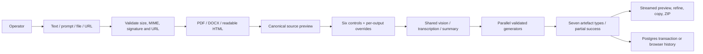

# Content Forge architecture — SIH 26154

## Page 1: pipeline

Next.js App Router serves the React operator console and Node route handlers. The existing layered structure is retained: `src/frontend` for UI, `src/agent` for AI and ingestion, `src/backend` for auth/storage, and `src/lib` for reusable typed domain/security logic.

`/api/ingest` accepts multipart or JSON and exposes a preview before generation. File boundaries enforce actual byte lengths and signatures. Document parsers expose warnings instead of binary text fallbacks. URL retrieval pins public DNS addresses to connections, revalidates redirects, bounds time and bytes, and does not execute scripts. Image OCR and video transcription are best-effort; original source data is retained for inspection.

`/api/transform` is the canonical endpoint; `/batch` and single-output requests are compatibility paths. The orchestrator enriches each source once and shares its summary across isolated output tasks. Zod schemas generate provider JSON contracts and validate responses. Invalid/provider-failed responses produce explicitly labeled, schema-valid templates using source excerpts. Source faithfulness takes precedence over word-count targets. Controls and overrides flow into prompts; language, evidence and format checks flag review needs.

## Page 2: outputs, persistence and operation

Seven modules support LinkedIn, Twitter/X, Advisory, Infographic, Executive Summary, Video Package and Presentation. All artefacts contain renderable Markdown, structured metadata, confidence, attribution and warnings. Video includes 6–8 storyboard scenes and estimated SRT/VTT; ElevenLabs audio is optional. Presentations include 8–12 slides and speaker notes; Presenton PPTX is optional. Shared export logic creates actual ZIP files containing Markdown/JSON and available media/subtitles. No generated content is published automatically.

Jobs have stable UUIDs, source bundles, controls/overrides, artefacts, timestamps, warnings, failed outputs and done/partial/failed status. Migrations 001–003 preserve legacy tables and add job metadata and rate limits. Job, artefact, document, audit and analytics writes share one Postgres transaction. History supports inspection, original-source refinement and deletion. Without a database, up to 20 browser jobs are retained; quota failures are visible and downloads remain available. No asynchronous worker is claimed: streaming generation lives within the HTTP request lifetime.

The application is a single-operator access-code workspace. The `/login` page opens a signed session; all eight workspace routes and job APIs require it, including in local demo mode. Server-signed expiring cookies protect APIs; production requires a configured code. Database-backed rate limits enforce ten generation requests per hour per trusted IP; development uses a process-local fallback. Secrets stay server-side. Health returns configuration booleans and readiness, not credentials. HTTPS and verified database TLS are deployment responsibilities. Hosted upload/request-duration limits may be lower than local limits; large object storage and durable workers are future deployment extensions.

Validation includes Vitest domain/API/provider contract tests, real PDF/DOCX fixtures and a Playwright PDF → three outputs → ZIP → refinement → history workflow. The route-backed shell exposes Dashboard, New Transformation, Documents, Workspace, Review Queue, History, Analytics and Settings. Legacy social screens are absent from the shell; the former feature flag no longer enables them. LinkedIn/X are secondary output choices. Reviews live in artefact metadata and produce audit records; refinement resets the changed artefact to pending while preserving sibling approvals. Analytics derives only transformation/output/review counts.
